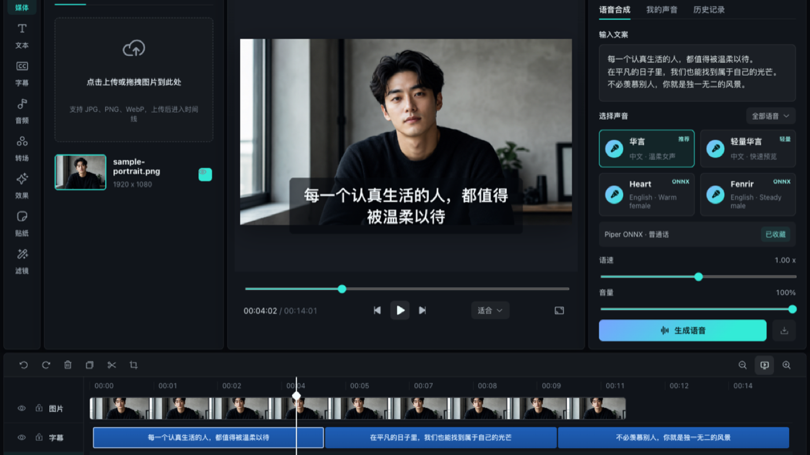

 

## Timeline Studio

**AI video editing—inside your browser.** Creators and AI agents work on the same real timeline. Voice, captions, vision effects, and export stay editable instead of becoming flattened output.

**LOCAL INFERENCE** with ONNX Runtime, WebGPU, and WASM · **EDITABLE TIMELINE** for real clips, captions, effects, and keyframes · **PRIVACY BY DESIGN** to avoid unnecessary uploads.

[Launch Studio →](https://video-editor.ai-creator.top/) · [Explore the source →](https://github.com/MartinDelophy/ai-video-editor)

## Recognition

🏆 **Summer Bug Smash Winner — Clear the Lineup (2026)**  
One of five Clear the Lineup winners in DEV's Big Summer Bug Smash, powered by Sentry, for fixing a mobile click-through bug caused by unmounting a React portal on pointer down.

[Official winner announcement →](https://dev.to/devteam/congrats-to-the-summer-bug-smash-winners-50ei) · [Read the debugging write-up →](https://dev.to/martindelophy/fixing-a-mobile-click-through-bug-caused-by-unmounting-a-react-portal-on-pointerdown-1104)

## Selected work

- [**Timeline Studio**](https://github.com/MartinDelophy/ai-video-editor) · [Live demo](https://video-editor.ai-creator.top/) — local-first browser AI video editing on a shared creator-and-agent timeline.
- [**Awesome GPT-6 Astra**](https://github.com/MartinDelophy/awesome-gpt-6-astra) · [Play games](https://astragames.aigccreative.com/) — a community-curated collection of GPT-6 Astra games, with playable demos and creator stories.
- [**Awesome AIGC Creative Contests**](https://github.com/MartinDelophy/Awesome-AIGC-Creative-Contests) — a continuously verified directory of active creative AI competitions.
- [**Vocal Remover Web**](https://github.com/MartinDelophy/vocal-remover-web) · [Live demo](https://ai-creator.top/vocalremove) — browser-side vocal and instrumental separation.
- [**DeOldify ONNX Web**](https://github.com/MartinDelophy/deoldify-onnx-web) · [Live demo](https://ai-creator.top/photocolorize) — old-photo colorization with ONNX Runtime Web.
- [**Depth Anything Web**](https://github.com/MartinDelophy/depth-anything-quantize) · [Live demo](http://depth-anything-quantize-myss.vercel.app) — quantized monocular depth estimation in the browser.

## The thread through my work

I explore how far the browser can go as a serious AI application runtime. The interesting part begins after the model demo: graph optimization, GPU/WASM inference, workers, caching, media pipelines, temporal vision, responsive interfaces, and product decisions that make advanced tools understandable.

Right now I am focused on:

- browser-native AI video creation with privacy-friendly local inference;
- temporal computer vision that understands more than the first frame;
- reliable speech, caption, audio, and export pipelines;
- creative interfaces that keep AI output editable.

### Build close to the user.

[Website](https://ai-creator.top/) · [DEV Community](https://dev.to/martindelophy) · [Timeline Studio](https://video-editor.ai-creator.top/)

