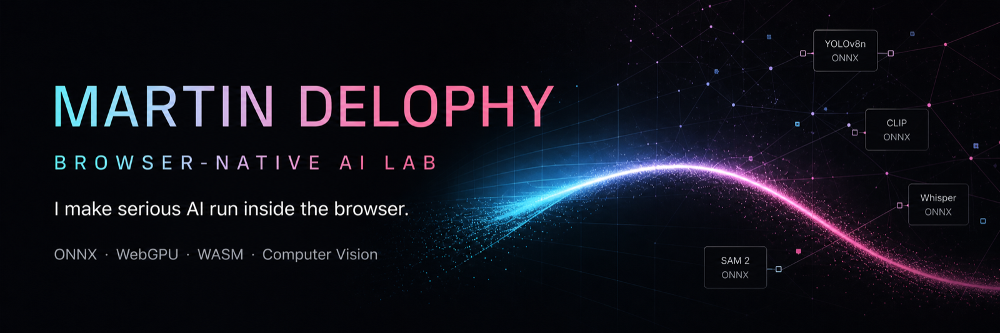
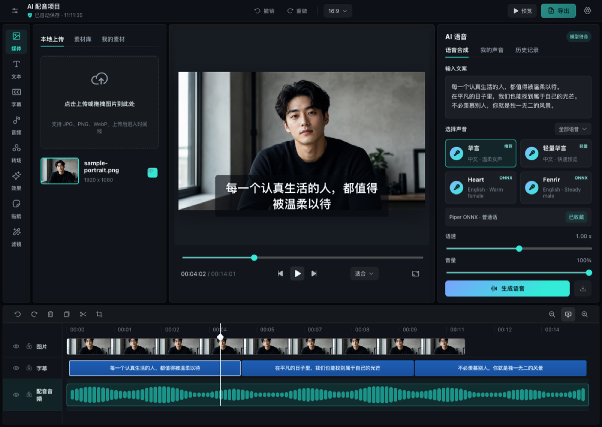

 

## Timeline Studio

<table>
  <tr>
    <td width="62%" valign="top">
      
    </td>
    <td width="38%" valign="top">
      <h3>AI video editing—inside your browser.</h3>
      
Creators and AI agents work on the same real timeline. Voice, captions, vision effects, and export stay editable instead of becoming flattened output.

      
<strong>LOCAL-FIRST · OPEN SOURCE</strong>

      

        <a href="https://video-editor.ai-creator.top/">Launch Studio →</a> 
        <a href="https://github.com/MartinDelophy/ai-video-editor">Explore the source →</a>
      

    </td>
  </tr>
  <tr>
    <td colspan="2">
      <strong>LOCAL INFERENCE</strong> 
      ONNX Runtime, WebGPU, and WASM keep useful AI close to the user's device ·
      <strong>EDITABLE TIMELINE</strong> turns AI results into real clips, captions, effects, and keyframes ·
      <strong>PRIVACY BY DESIGN</strong> avoids unnecessary uploads and preserves local control.
    </td>
  </tr>
</table>

## Selected work

| Project | Signal |
| --- | --- |
| [**Timeline Studio**](https://github.com/MartinDelophy/ai-video-editor) · [Live demo](https://video-editor.ai-creator.top/) | Local-first browser AI video editor with a shared creator-and-agent timeline. |
| [**Awesome AIGC Creative Contests**](https://github.com/MartinDelophy/Awesome-AIGC-Creative-Contests) | Continuously verified directory of active creative AI competitions. |
| [**Vocal Remover Web**](https://github.com/MartinDelophy/vocal-remover-web) · [Live demo](https://ai-creator.top/vocalremove) | Browser-side vocal and instrumental separation. |
| [**DeOldify ONNX Web**](https://github.com/MartinDelophy/deoldify-onnx-web) · [Live demo](https://ai-creator.top/photocolorize) | Old-photo colorization with ONNX Runtime Web. |
| [**Depth Anything Web**](https://github.com/MartinDelophy/depth-anything-quantize) · [Live demo](http://depth-anything-quantize-myss.vercel.app) | Quantized monocular depth estimation in the browser. |

## The thread through my work

I explore how far the browser can go as a serious AI application runtime. The interesting part begins after the model demo: graph optimization, GPU/WASM inference, workers, caching, media pipelines, temporal vision, responsive interfaces, and product decisions that make advanced tools understandable.

Right now I am focused on:

- browser-native AI video creation with privacy-friendly local inference;
- temporal computer vision that understands more than the first frame;
- reliable speech, caption, audio, and export pipelines;
- creative interfaces that keep AI output editable.

### Build close to the user.

[Website](https://ai-creator.top/) · [DEV Community](https://dev.to/martindelophy) · [Timeline Studio](https://video-editor.ai-creator.top/)

